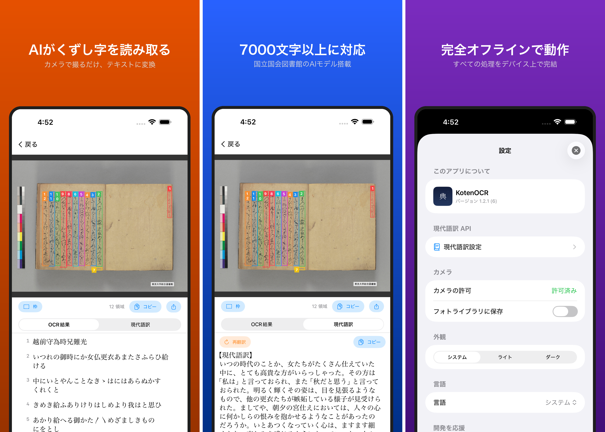

# KotenOCR

古典籍・くずし字と近代活字をAIで読み取るiOS OCRアプリ。
An iOS OCR app that reads classical Japanese cursive script (kuzushiji) and modern printed text using AI.

国立国会図書館の [NDL古典籍OCR-Lite](https://github.com/ndl-lab/ndlkotenocr-lite) および [NDLOCR-Lite](https://github.com/ndl-lab/ndlocr-lite) モデルを搭載し、すべての処理をデバイス上で完結します。インターネット接続は不要です。
Powered by the National Diet Library's NDL Koten OCR-Lite and NDLOCR-Lite models. All processing runs entirely on-device — no internet connection required.

[](https://apps.apple.com/jp/app/kotenocr/id6760045646)



## 機能 / Features

- **2つのOCRモード / Dual OCR modes** — 古典籍（くずし字）と近代（活字・手書き）を切り替えて使用 / Switch between Classical (kuzushiji) and Modern (printed/handwritten) modes
- **カメラ撮影 / フォトライブラリ / Camera & Photo Library** — 撮影または選択してOCR実行 / Capture or select images for OCR
- **認識結果の閲覧・編集 / View & Edit Results** — 検出領域のボックス表示、テキスト手動修正 / Bounding box overlay, manual text correction
- **エクスポート / Export** — テキスト共有 / TXT / PDF / Share text, TXT, or PDF
- **スキャン履歴 / Scan History** — OCR結果を自動保存 / Auto-save OCR results
- **現代語訳 / Modern Translation** — 古文を現代語に翻訳 / Translate classical Japanese to modern Japanese
  - ローカルAI（Apple Foundation Models, iOS 26+） / Local AI (offline)
  - クラウドAPI（OpenAI互換） / Cloud API (OpenAI-compatible)
- **多言語対応 / Multilingual** — 日本語 / English
- **応援（Tip Jar）** — StoreKit 2によるアプリ内課金 / In-app tips via StoreKit 2

## OCRモード / OCR Modes

| モード / Mode | 対象 / Target | 検出 / Detection | 認識 / Recognition |
|--------|------|-----------|-----------|
| 古典籍 / Classical | くずし字 / Kuzushiji | RTMDet-S | PARSeq (1 model) |
| 近代 / Modern | 活字・手書き / Printed & handwritten | DEIMv2-S | PARSeq cascade (3 models) |

認識処理は並列化されており、近代モードでは最大6.7倍の高速化を実現しています。
Recognition is parallelized — up to 6.7x speedup in Modern mode.

## 要件 / Requirements

- iOS 16.0+
- Xcode 15.0+
- Swift 5.9

## セットアップ / Setup

```bash
git clone https://github.com/nakamura196/koten-ocr-ios.git
cd koten-ocr-ios

# Download ONNX models (~230MB total)
./setup.sh

# Generate Xcode project
xcodegen generate

open KotenOCR.xcodeproj
```

### ONNXモデル / ONNX Models

`KotenOCR/Models/` に配置（`.gitignore` で除外済み、`setup.sh` で自動ダウンロード）。
Placed in `KotenOCR/Models/` (gitignored, auto-downloaded by `setup.sh`).

#### 古典籍 / Classical (NDL Koten OCR-Lite)

| モデル / Model | ファイル / File | サイズ / Size |
|--------|-----------|--------|
| テキスト検出 / Text detection (RTMDet-S) | `rtmdet-s-1280x1280.onnx` | ~40MB |
| 文字認識 / Character recognition (PARSeq) | `parseq-ndl-32x384-tiny-10.onnx` | ~38MB |

#### 近代 / Modern (NDLOCR-Lite)

| モデル / Model | ファイル / File | サイズ / Size |
|--------|-----------|--------|
| レイアウト検出 / Layout detection (DEIMv2-S) | `deim-s-1024x1024.onnx` | ~38MB |
| 文字認識 30文字 / Recognition 30-char (PARSeq) | `parseq-ndl-16x256-30-...onnx` | ~34MB |
| 文字認識 50文字 / Recognition 50-char (PARSeq) | `parseq-ndl-16x384-50-...onnx` | ~35MB |
| 文字認識 100文字 / Recognition 100-char (PARSeq) | `parseq-ndl-16x768-100-...onnx` | ~39MB |

## ビルド / Build

```bash
# Debug build
xcodebuild build \
  -project KotenOCR.xcodeproj \
  -scheme KotenOCR \
  -destination 'generic/platform=iOS'

# Archive for App Store
./scripts/archive.sh
```

## ライセンス / License

このプロジェクトは [MIT License](LICENSE) のもとで公開されています。
This project is released under the [MIT License](LICENSE).

### OCRモデル / OCR Models
- **NDL古典籍OCR-Lite** — [CC-BY-4.0](https://creativecommons.org/licenses/by/4.0/) (National Diet Library / 国立国会図書館)
- **NDLOCR-Lite** — [CC-BY-4.0](https://creativecommons.org/licenses/by/4.0/) (National Diet Library / 国立国会図書館)

### 依存ライブラリ / Dependencies
- **ONNX Runtime** — [MIT License](https://github.com/microsoft/onnxruntime/blob/main/LICENSE) (Microsoft)
